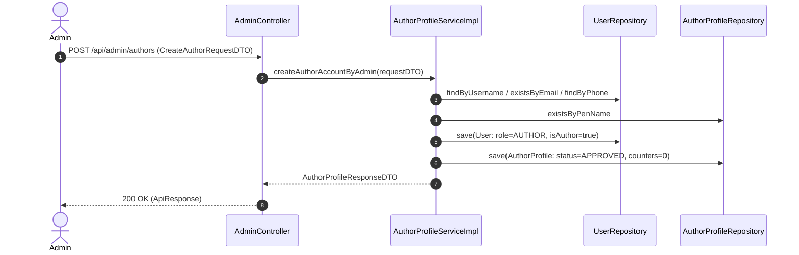
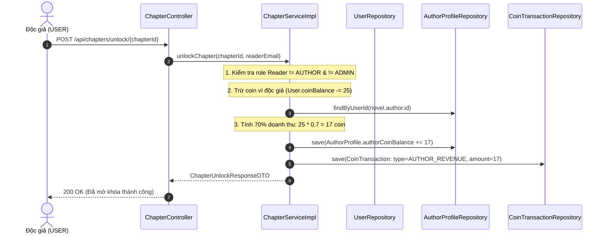
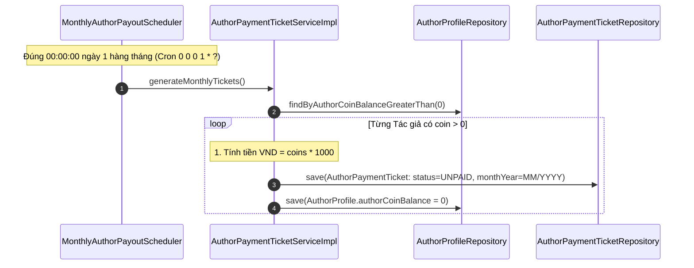
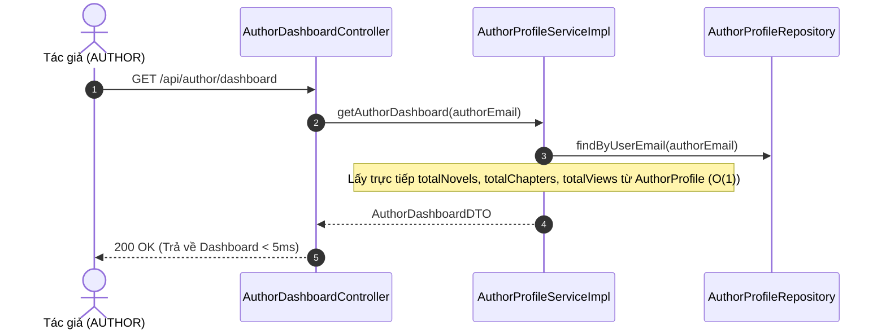
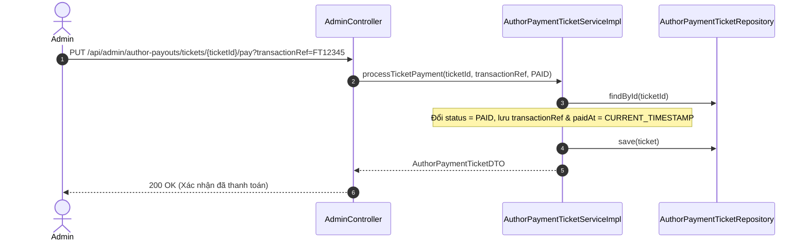

# BÁO CÁO CHI TIẾT TẤT CẢ THAY ĐỔI VÀ TỐI ƯU HỆ THỐNG
## Phân Hệ Hồ Sơ Tác Giả (AuthorProfile), Quyết Toán Doanh Thu (AuthorPaymentTicket) & Tối Ưu Thống Kê Dashboard

---

## 📋 MỤC LỤC
1. [TỔNG QUAN HỆ THỐNG & ĐỊNH HƯỚNG KIẾN TRÚC](#1-tổng-quan-hệ-thống--định-hướng-kiến-trúc)
2. [CHI TIẾT CÁC LỚP LAYER](#2-chi-tiết-các-lớp-layer)
   - [2.1. Layer Database (DDL & DML Scripts)](#21-layer-database-ddl--dml-scripts)
   - [2.2. Layer Entity & Enumerations](#22-layer-entity--enumerations)
   - [2.3. Layer Repository](#23-layer-repository)
   - [2.4. Layer DTO (Data Transfer Object)](#24-layer-dto-data-transfer-object)
   - [2.5. Layer Service & Business Logic](#25-layer-service--business-logic)
   - [2.6. Layer Scheduler (Tự Động Hóa)](#26-layer-scheduler-tự-động-hóa)
   - [2.7. Layer Controller (RESTful APIs)](#27-layer-controller-restful-apis)
3. [CHI TIẾT CÁC LUỒNG ĐI CỦA CODE (CODE FLOWS)](#3-chi-tiết-các-luồng-đi-của-code-code-flows)
   - [Luồng 1: Admin Tạo Tài Khoản Tác Giả](#luồng-1-admin-tạo-tài-khoản-tác-giả)
   - [Luồng 2: Độc Giả Mua Chapter VIP & Trích Doanh Thu Ví Tác Giả](#luồng-2-độc-giả-mua-chapter-vip--trích-doanh-thu-ví-tác-giả)
   - [Luồng 3: Scheduler Chốt Sổ Quyết Toán Tự Động Hàng Tháng](#luồng-3-scheduler-chốt-sổ-quyết-toán-tự-động-hàng-tháng)
   - [Luồng 4: Tác Giả Xem Dashboard Tối Ưu O(1)](#luồng-4-tác-giả-xem-dashboard-tối-ưu-o1)
   - [Luồng 5: Admin Xác Nhận Thanh Toán Chuyển Khoản Ticket](#luồng-5-admin-xác-nhận-thanh-toán-chuyển-khoản-ticket)
4. [GIẢI THÍCH CHUYÊN SÂU CÁCH HOẠT ĐỘNG CỦA REDIS TRONG HỆ THỐNG](#4-giải-thích-chuyên-sâu-cách-hoạt-động-của-redis-trong-hệ-thống)

---

## 1. TỔNG QUAN HỆ THỐNG & ĐỊNH HƯỚNG KIẾN TRÚC

### 🎯 Mục tiêu tái cấu trúc:
1. **Tách biệt hoàn toàn Ví Độc Giả & Ví Tác Giả**:
   - **Ví Độc Giả (`User.coinBalance`)**: Lưu số coin nạp vào từ các gói thanh toán VNPay/ZaloPay để dùng mua chapter. Bảng `payments` chỉ phục vụ duy nhất cho độc giả nạp tiền.
   - **Ví Tác Giả (`AuthorProfile.authorCoinBalance`)**: Lưu số coin tích lũy từ **doanh thu bán chapter trả phí** (hệ thống trích 70% giá trị chapter).
2. **Loại bỏ quy trình Đăng ký/Phê duyệt rườm rà**:
   - Admin chủ động tạo tài khoản cho Tác giả qua API `POST /api/admin/authors`. Hệ thống khởi tạo đồng thời `User` (Role `AUTHOR`) và `AuthorProfile` liên kết `1-1`.
3. **Cơ chế Chốt sổ Doanh thu Hàng tháng tự động (`AuthorPaymentTicket`)**:
   - Vào `00:00:00` ngày đầu tiên hàng tháng, Scheduler tự động quy đổi toàn bộ `authorCoinBalance` của từng tác giả thành **Phiếu quyết toán (`AuthorPaymentTicket`)** theo tỷ lệ `1 Coin = 1,000 VND`, đặt trạng thái `UNPAID` và reset `authorCoinBalance = 0`.
   - Admin xem danh sách phiếu và xác nhận chuyển khoản ngoài đời $\rightarrow$ chuyển trạng thái ticket sang `PAID`.
4. **Tối ưu hóa Thống kê Dashboard bằng Denormalization Counters**:
   - Đưa 3 trường số liệu đếm dồn `totalNovels`, `totalChapters`, `totalViews` trực tiếp vào bảng `author_profiles`. Giảm độ phức tạp của API `Author Dashboard` từ $O(N)$ quét toàn bảng xuống **$O(1)$ truy vấn 1 dòng duy nhất (< 5ms)**.

---

## 2. CHI TIẾT CÁC LỚP LAYER

### 2.1. Layer Database (DDL & DML Scripts)

#### Bảng `author_profiles`:
```sql
CREATE TABLE author_profiles (
    id                  UNIQUEIDENTIFIER NOT NULL DEFAULT NEWID() PRIMARY KEY,
    user_id             UNIQUEIDENTIFIER NOT NULL,
    pen_name            NVARCHAR(255)    NOT NULL,
    bio                 NVARCHAR(MAX)    NULL,
    author_coin_balance INT              NOT NULL DEFAULT 0,
    total_novels        BIGINT           NOT NULL DEFAULT 0,
    total_chapters      BIGINT           NOT NULL DEFAULT 0,
    total_views         BIGINT           NOT NULL DEFAULT 0,
    bank_name           NVARCHAR(100)    NULL,
    bank_account_number NVARCHAR(100)    NULL,
    bank_account_holder NVARCHAR(255)    NULL,
    status              NVARCHAR(20)     NOT NULL DEFAULT 'APPROVED' CHECK (status IN ('PENDING','APPROVED','REJECTED','SUSPENDED')),
    created_at          DATETIME2        NOT NULL DEFAULT SYSUTCDATETIME(),
    updated_at          DATETIME2        NOT NULL DEFAULT SYSUTCDATETIME(),
    CONSTRAINT uq_author_profiles_user UNIQUE (user_id),
    CONSTRAINT fk_ap_user FOREIGN KEY (user_id) REFERENCES users(id) ON DELETE CASCADE
);
```

#### Bảng `author_payment_tickets`:
```sql
CREATE TABLE author_payment_tickets (
    id                UNIQUEIDENTIFIER NOT NULL DEFAULT NEWID() PRIMARY KEY,
    author_profile_id UNIQUEIDENTIFIER NOT NULL,
    month_year        NVARCHAR(20)     NOT NULL,
    total_coins       INT              NOT NULL,
    coin_rate         INT              NOT NULL DEFAULT 1000,
    amount_vnd        INT              NOT NULL,
    status            NVARCHAR(20)     NOT NULL DEFAULT 'UNPAID' CHECK (status IN ('UNPAID','PAID','CANCELLED')),
    paid_at           DATETIME2        NULL,
    transaction_ref   NVARCHAR(100)    NULL,
    created_at        DATETIME2        NOT NULL DEFAULT SYSUTCDATETIME(),
    updated_at        DATETIME2        NOT NULL DEFAULT SYSUTCDATETIME(),
    CONSTRAINT fk_apt_author FOREIGN KEY (author_profile_id) REFERENCES author_profiles(id) ON DELETE CASCADE
);
```

* **Files liên quan**: `schema-mssql.sql`, `data-mssql.sql`, `data.sql`, `data-h2.sql`.

---

### 2.2. Layer Entity & Enumerations

* **`AuthorProfile.java`**: Thừa kế `BaseEntity`, liên kết `@OneToOne` với `User`. Lưu thông tin bút danh, bio, ví coin tác giả, tài khoản ngân hàng và 3 counter `totalNovels`, `totalChapters`, `totalViews`.
* **`AuthorPaymentTicket.java`**: Thừa kế `BaseEntity`, liên kết `@ManyToOne` với `AuthorProfile`. Lưu thông tin ticket quyết toán từng tháng.
* **`User.java`**: Bổ sung `@OneToOne(mappedBy = "user") private AuthorProfile authorProfile;`.
* **Enums mới/sửa**:
  * `UserRole.java`: Bổ sung value `AUTHOR`.
  * `AuthorStatus.java`: Enum `PENDING`, `APPROVED`, `REJECTED`, `SUSPENDED`.
  * `TicketStatus.java`: Enum `UNPAID`, `PAID`, `CANCELLED`.
  * `CoinTransactionType.java`: Bổ sung `AUTHOR_REVENUE` (doanh thu trích cho tác giả khi bán chapter).

---

### 2.3. Layer Repository

* **`AuthorProfileRepository.java`**:
  * `Optional<AuthorProfile> findByUserId(UUID userId);`
  * `Optional<AuthorProfile> findByUserEmail(String email);`
  * `boolean existsByPenName(String penName);`
  * `boolean existsByPenNameAndUserIdNot(String penName, UUID userId);`
* **`AuthorPaymentTicketRepository.java`**:
  * `List<AuthorPaymentTicket> findByAuthorProfileUserEmailOrderByCreatedAtDesc(String email);`
  * `List<AuthorPaymentTicket> findByStatusOrderByCreatedAtDesc(TicketStatus status);`
  * `boolean existsByAuthorProfileIdAndMonthYear(UUID authorProfileId, String monthYear);`
* **`ChapterRepository.java`**:
  * `long countByNovelId(Long novelId);`
  * `@Query("SELECT COUNT(c) FROM Chapter c WHERE c.novel.author.id = :authorUserId") long countByAuthorUserId(@Param("authorUserId") UUID authorUserId);`
* **`NovelRepository.java`**:
  * `@Query("SELECT COALESCE(SUM(n.viewCount), 0) FROM Novel n WHERE n.author.id = :authorId") long sumViewCountByAuthorId(@Param("authorId") UUID authorId);`

---

### 2.4. Layer DTO (Data Transfer Object)

* **`CreateAuthorRequestDTO.java`**: DTO chứa thông tin khi Admin tạo tài khoản Tác giả (username, email, password, phone, penName, bio, ngân hàng...).
* **`AuthorProfileRequestDTO.java`**: DTO cho Tác giả cập nhật profile (penName, bio, thông tin ngân hàng).
* **`AuthorProfileResponseDTO.java`**: DTO trả về thông tin hồ sơ Tác giả kèm 3 con số thống kê `totalNovels`, `totalChapters`, `totalViews`.
* **`AuthorPaymentTicketDTO.java`**: DTO chi tiết ticket quyết toán hàng tháng.
* **`AuthorDashboardDTO.java`**: DTO tổng hợp cho màn hình Author Dashboard (Profile, totalNovels, totalChapters, totalViews, authorCoinBalance, estimatedEarningsVnd, recentTickets).

---

### 2.5. Layer Service & Business Logic

#### 1. `AuthorProfileServiceImpl.java`:
* `createAuthorAccountByAdmin`: Kiểm tra trùng lặp `username`, `email`, `phone`, `penName`. Đã dùng `PasswordEncoder` mã hóa pass, tạo `User` (Role `AUTHOR`) và `AuthorProfile` trạng thái `APPROVED`.
* `getMyAuthorProfile`: Tìm `AuthorProfile` theo `userEmail`. Nếu không tìm thấy ném lỗi `404 RESOURCE_NOT_FOUND`.
* `updateMyAuthorProfile`: Cập nhật bút danh, bio, thông tin ngân hàng.
* `getAuthorDashboard`: Lấy `AuthorProfile` của tác giả và trả về thông số thống kê đếm dồn $O(1)$ mà không cần quét bảng.

#### 2. `AuthorPaymentTicketServiceImpl.java`:
* `generateMonthlyTickets`: Lặp qua tất cả `AuthorProfile` có `authorCoinBalance > 0`. Tính `amountVnd = authorCoinBalance * 1000`, tạo record `AuthorPaymentTicket` trạng thái `UNPAID` và reset `authorCoinBalance = 0`.
* `processTicketPayment`: Admin duyệt đổi trạng thái ticket thành `PAID` kèm mã tham chiếu giao dịch chuyển khoản `transactionRef`.

#### 3. `ChapterServiceImpl.java`:
* `unlockChapter`:
  - Kiểm tra nếu Role là `AUTHOR` hoặc `ADMIN` $\rightarrow$ Ném lỗi `400 BAD_REQUEST` ("Tài khoản Tác giả / Admin không thể mua chapter").
  - Khi `USER` mua chapter thành công (ví dụ: 25 coin): Trích 70% (17 coin) cộng vào `AuthorProfile.authorCoinBalance` của tác giả bộ truyện đó. Ghi log `CoinTransaction` loại `AUTHOR_REVENUE`.
* `createChapter`: Tự động cộng dồn `AuthorProfile.totalChapters + 1`.
* `readChapter`: Tự động cộng dồn `AuthorProfile.totalViews + 1` và `Novel.viewCount + 1`.

#### 4. `NovelServiceImpl.java`:
* `createNovel`: Kiểm tra tài khoản có `isAuthor = true` hay không. Sau khi lưu truyện, tự động cộng dồn `AuthorProfile.totalNovels + 1`.

---

### 2.6. Layer Scheduler (Tự Động Hóa)

* **`MonthlyAuthorPayoutScheduler.java`**:
  - Đánh dấu `@Component` và `@EnableScheduling`.
  - Phương thức `runMonthlyAuthorPayout()` mang annotation:
    ```java
    @Scheduled(cron = "0 0 0 1 * ?") // Chạy tự động lúc 00:00:00 ngày 1 hàng tháng
    ```
  - Tự động gọi `authorPaymentTicketService.generateMonthlyTickets()` để quét và chốt sổ doanh thu tháng cũ.

---

### 2.7. Layer Controller (RESTful APIs)

#### 1. `AdminController.java` (`/api/admin`) - Đã áp dụng `@PreAuthorize("hasRole('ADMIN')")` ở cấp độ Class:
* `POST /api/admin/authors`: Admin tạo tài khoản Tác giả mới.
* `GET /api/admin/author-profiles`: Xem danh sách tất cả hồ sơ tác giả.
* `GET /api/admin/author-payouts/tickets`: Xem danh sách ticket quyết toán (`UNPAID`, `PAID`, `CANCELLED`).
* `PUT /api/admin/author-payouts/tickets/{ticketId}/pay`: Xác nhận đã thanh toán ticket (`PAID`).
* `POST /api/admin/author-payouts/trigger-scheduler`: Kích hoạt thủ công chốt sổ tháng (Dùng cho test).

#### 2. `AuthorDashboardController.java` (`/api/author`):
* Sử dụng `Authentication authentication` để lấy email chuẩn từ Spring SecurityContext.
* `GET /api/author/profile`: Lấy hồ sơ tác giả.
* `PUT /api/author/profile`: Cập nhật hồ sơ & tài khoản ngân hàng.
* `GET /api/author/dashboard`: Lấy thông tin tổng quan Dashboard.
* `GET /api/author/tickets`: Lấy danh sách ticket quyết toán cá nhân.

---

## 3. CHI TIẾT CÁC LUỒNG ĐI CỦA CODE (CODE FLOWS)

### Luồng 1: Admin Tạo Tài Khoản Tác Giả


---

### Luồng 2: Độc Giả Mua Chapter VIP & Trích Doanh Thu Ví Tác Giả


---

### Luồng 3: Scheduler Chốt Sổ Quyết Toán Tự Động Hàng Tháng


---

### Luồng 4: Tác Giả Xem Dashboard Tối Ưu O(1)


---

### Luồng 5: Admin Xác Nhận Thanh Toán Chuyển Khoản Ticket


---

## 4. GIẢI THÍCH CHUYÊN SÂU CÁCH HOẠT ĐỘNG CỦA REDIS TRONG HỆ THỐNG

### 4.1. Redis là gì và Tại sao dùng Redis trong Web Application lớn?
**Redis (Remote Dictionary Server)** là một cơ sở dữ liệu lưu trữ dạng **Key-Value trong bộ nhớ RAM (In-Memory Data Structure Store)**. 
* **Tốc độ đọc/ghi**: Đạt từ **100,000 đến 1,000,000 requests/giây** với độ trễ dưới **1 millisecond** (nhanh gấp hàng trăm lần so với đĩa cứng MSSQL/MySQL).

---

### 4.2. Cách hoạt động của Redis trong Caching Layer (`Cache-Aside Pattern`)

```
               +-------------------+
               |  Client / Request |
               +---------+---------+
                         |
                         v
               +-------------------+
               | Spring Boot App   |
               +----+---------+----+
                    |         |
          1. Check Cache      | 3. Cache Miss -> Query DB
                    |         |
                    v         v
               +----+---+ +---+-----+
               | Redis  | | MSSQL   |
               | (RAM)  | | (Disk)  |
               +--------+ +---------+
```

1. **Bước 1 (Check Cache)**: Khi Tác giả gọi `GET /api/author/dashboard`, Spring Boot sẽ kiểm tra xem Key `author:dashboard:author@sba.com` có tồn tại trong Redis RAM hay không.
2. **Bước 2 (Cache Hit)**: Nếu **CÓ**, Redis trả ngay dữ liệu JSON về cho Client trong 1-2ms mà **không cần chạm vào MSSQL Database**.
3. **Bước 3 (Cache Miss)**: Nếu **KHÔNG** (lần đầu truy cập hoặc cache đã hết hạn TTL):
   - App truy vấn MSSQL lấy dữ liệu.
   - App ghi dữ liệu đó vào Redis kèm thời gian hết hạn (ví dụ `TTL = 10 phút`).
   - Trả dữ liệu về cho Client. Các request tiếp theo trong 10 phút đó sẽ ăn trực tiếp từ Redis RAM.

---

### 4.3. Ứng dụng Redis cho Counter / Rate Limiting & Concurrent Distributed Lock (Chống Race Condition)

Ngoài việc làm Caching, Redis còn hỗ trợ giải quyết 2 vấn đề lớn trong các hệ thống đọc truyện / thương mại điện tử:

#### 1. Redis Atomic Increment (`INCRBY`) cho lượt xem (View Count):
* **Vấn đề**: Khi 10,000 người đọc cùng click xem chương truyện trong 1 giây, nếu câu lệnh `UPDATE chapters SET view_count = view_count + 1` gửi trực tiếp vào MSSQL, DB sẽ bị **Row Lock Contention** và sập kết nối.
* **Giải pháp với Redis**:
  - Dùng lệnh `INCR chapter:views:101` trên Redis RAM. Phép cộng này là **Atomic** (bất biến, không bị xung đột luồng).
  - Sau mỗi 5 phút, 1 Scheduled Job lấy số dư đếm được từ Redis để `UPDATE` 1 lần duy nhất vào MSSQL (Batch Update).

#### 2. Redis Distributed Lock (`Redlock / Redisson`) khi Độc giả mua Chapter VIP:
* **Vấn đề (Race Condition)**: Độc giả có 25 coin, click nút Mua Chapter 2 lần liên tiếp trong vài millisecond. Nếu 2 request chạy song song trên 2 thread của server, cả 2 thread đều kiểm tra `coinBalance >= 25` hợp lệ $\rightarrow$ tài khoản độc giả bị trừ thành 0 coin nhưng hệ thống xử lý mua 2 lần.
* **Giải pháp với Redis Redlock**:
  - Thread 1 xin khóa: `SET lock:user:98bc5d NX EX 5` (Đặt khóa trên Redis cho User này trong 5s).
  - Thread 1 vào thực hiện trừ coin và trích doanh thu cho Tác giả.
  - Thread 2 đến, thấy Key `lock:user:98bc5d` đã tồn tại trên Redis $\rightarrow$ bị chặn lại hoặc chờ Thread 1 xử lý xong mới được vào. Điều này đảm bảo **Tính nhất quán dữ liệu (Data Consistency)** tuyệt đối.

---

### 4.4. So sánh Tổng quan giữa DB Denormalization vs Redis Cache

| Tiêu chí | DB Denormalization (Đã làm ở bài này) | Redis Caching Layer |
| :--- | :--- | :--- |
| **Vị trí lưu trữ** | Đĩa cứng / DBMSSQL (`author_profiles`) | Bộ nhớ RAM (Redis Server) |
| **Độ phức tạp Query** | $O(1)$ đọc 1 dòng DB | $O(1)$ đọc từ RAM Key-Value |
| **Thời gian phản hồi** | ~ 3ms - 5ms | ~ 1ms |
| **Tính sẵn sàng (Persistence)** | Tuyệt đối (Không mất khi sập nguồn) | Tùy cấu hình RDB/AOF (RAM mất nếu crash không save) |
| **Độ phức tạp triển khai** | Đơn giản, chèn vài cột vào Entity | Cần cài đặt Redis Server, cấu hình Spring Data Redis |

> **Kết luận**: Việc kết hợp lưu **Denormalized Counters trong DB** (đã thực hiện) cùng với **Redis Caching Layer** sẽ tạo nên một kiến trúc Backend cực kỳ mạnh mẽ, chịu tải cao và đạt chuẩn Enterprise Production.
