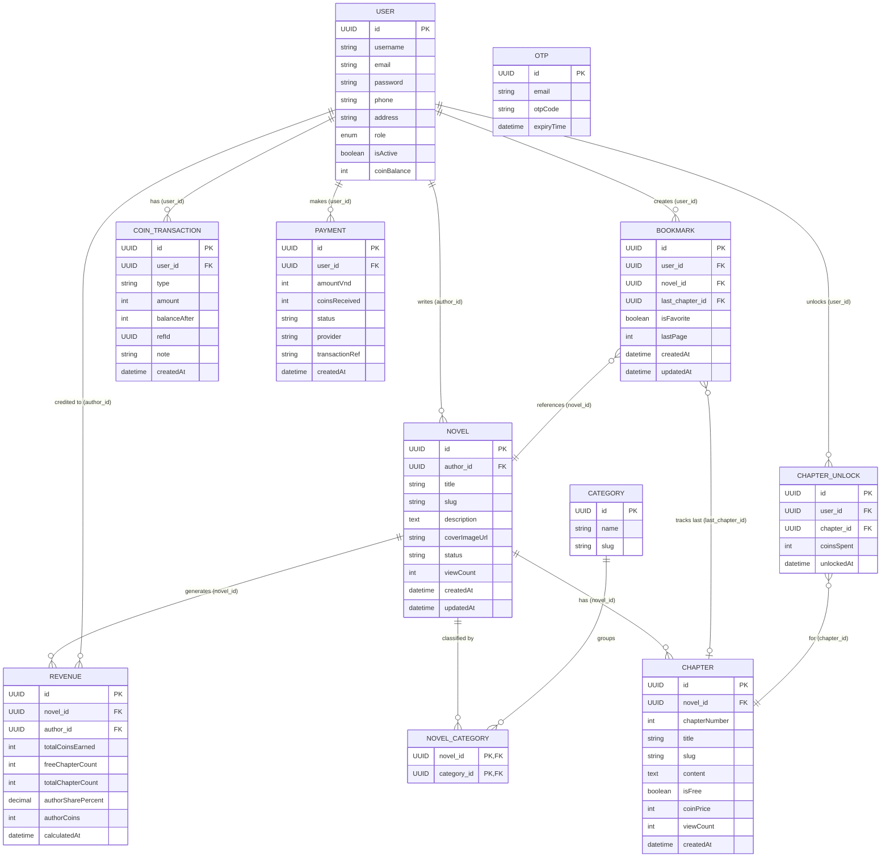

# Conceptual ER Diagram — Novel Reading Platform

## Entities & Attributes

| Entity | Key Attributes |
|---|---|
| **User** | id, username, email, password, phone, address, role *(ADMIN/AUTHOR/READER)*, isActive, coinBalance |
| **Novel** | id, title, slug, description, coverImageUrl, status *(ongoing/completed)*, viewCount, createdAt, updatedAt |
| **Chapter** | id, chapterNumber, title, slug, content, isFree, coinPrice, viewCount, createdAt |
| **Category** | id, name, slug |
| **NovelCategory** *(join)* | novelId (PK/FK), categoryId (PK/FK) |
| **Bookmark** | id, isFavorite, lastPage, createdAt, updatedAt |
| **ChapterUnlock** | id, coinsSpent, unlockedAt |
| **CoinTransaction** | id, type, amount, balanceAfter, refId, note, createdAt |
| **Payment** | id, amountVnd, coinsReceived, status, provider, transactionRef, createdAt |
| **Revenue** | id, totalCoinsEarned, freeChapterCount, totalChapterCount, authorSharePercent, authorCoins, calculatedAt |
| **OTP** | id, email, otpCode, expiryTime |

## Relationships

## Summary Notes

- **NovelCategory** là bảng trung gian (join table) thể hiện quan hệ **Many-to-Many** giữa Novel và Category.
- **User** đóng 2 vai trò: `AUTHOR` (viết novel, nhận doanh thu) và `READER` (đọc, bookmark, unlock chapter).
- **CoinTransaction** ghi log mọi biến động coin của user (nạp, chi tiêu).
- **Payment** là giao dịch nạp tiền thực tế (VNPay,...) để đổi coin.
- **Revenue** là bảng tính toán tổng doanh thu của tác giả theo novel.
- **OTP** là bảng độc lập phục vụ xác thực email, không liên kết FK với User.
